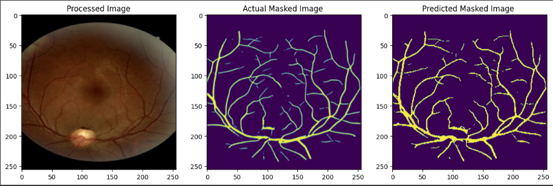
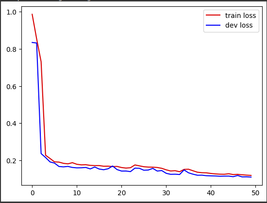
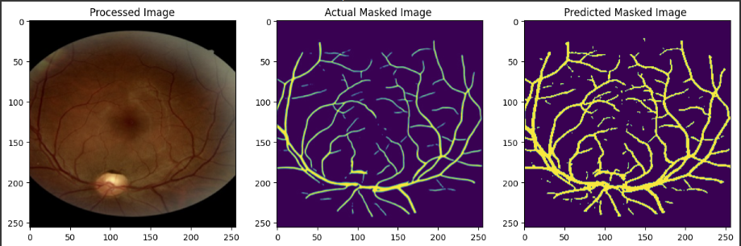
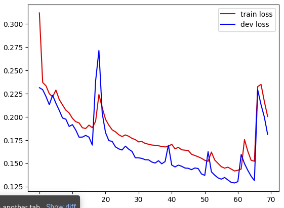

# Fundus2OCTA-Vascular-Mapping-with-GANs

## Objective
Segmenting blood vessels in fundus images enables better comprehension of retinal diseases and facilitates the computation of image-based biomarkers. However, manual vessel segmentation is a labor-intensive task. This project aims to automate vessel segmentation using generative adversarial networks (GANs).

## Approach
1. **Automated Strategy**:
   - Leveraging GANs to create vascular maps directly from fundus images.
   - No need for training based on manual vessel segmentation maps.

2. **Post-Processing and OCT-A**:
   - Applying post-processing techniques to standard en face OCT-A images.
   - Generating vessel segmentation maps.

3. **Advantages**:
   - Improved vascular maps for the optic disc area.
   - Synthetic OCT-A technique compares favorably to state-of-the-art vessel segmentation algorithms.

## Dataset Availability
The authors plan to make their dataset publicly available.

**DOI**: 10.1038/s41598-023-42062-9

## Code Implementation

### 1. DatesetPrepration.py
- Python file for dataset preparation.
- Matches files in each folder and categorizes them for feeding into the models.

### 2. DataAgumentation.py
- Increases the dataset size.
- Contains two functions:
  - Rotation (90°, 180°, and 270°)
  - Mirroring the dataset.

### 3. fundus2octa.ipynb
- Implements the GAN model (pix2pix) to translate fundus images to OCT.
- Results are stored in the "result" directory and inside the "synthesized_octa" folder.

### 4. (SA-itter)UNet_Image_Segmentation.ipynb
- Implements SAUnet and itterUnet for segmenting fundus images.
- Results are saved in the "result" directory under "itter" and "saunet" datasets.

### 5. etdrs_grid.py
- Performs ETDRS griding and divides eye images into four sections:
  - Superior
  - Temporal
  - Nasal
  - Inferior
- Result images are stored in the "Result_divided" directory with categories: t, b, r, l.

### 6. calculate_pearson_spearman.py
- Calculates two correlation methods for comparing result images with real OCTA images to determine diagnostic accuracy.

## Evaluation Method

### ETDRS Gride

## Result

### Gan (pix2pix) Training 

### SA-Unet Training

### itter-Unet Training

	
	

### Correlation Score
	

